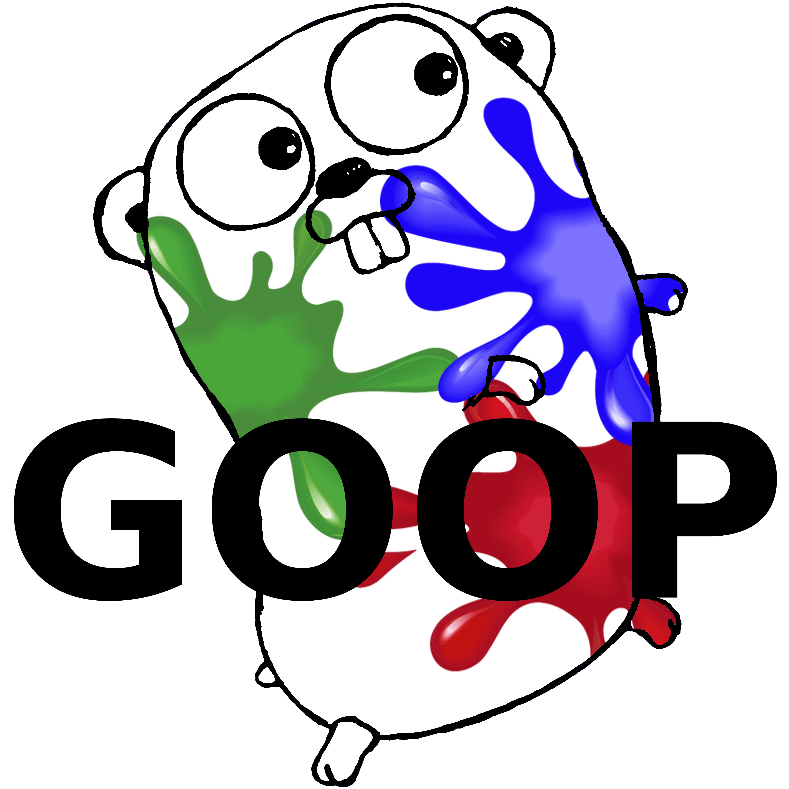

<p align="center">
    
</p>

# Golang for Object Oriented Programmers
**Native Golang method definition transpiling from C++ style declarations.**

## Motivation
Golang has unfortunate syntax requirements for writing member functions, and C++ style syntax offers similar functionality with less boilerplate. The project is a simple engine that allows the writing of C++ style definitions which are then transpiled into native/legal golang syntax.

## Overview
Goop doesn't change anything about the existing build process, and attempts to interfere as little as possible with the language's ecosystem. The engine looks for files recursively - so it simply needs to be pointed at the root of a project or called from inside the root folder. Working from dedicated `.goo` files, the engine rewrites function definitions and then outputs a standard golang `.go` file, which can be imported/built/run etc as usual.

## Style
#### Standard Functions
Go introduces a new syntax token when declaring variables, it is `:=` and is called a [short variable declaration](https://tour.golang.org/basics/10). Goop follows this syntax hinting closely, introducing the "short function declaration" thanks to C++ member functions having member and class names separated by the `::` token - in Goop _all_ functions are declared with this syntax token. Keeping with standard Go function syntax, in Goop all return types are optional and default to the `void` type.
<br><br>
**Named Function**
```
// GOLANG
func Hello(){ fmt.Println("Hello World!"); }
func Double(val int) int { return 2 * val; }

// GOOP
::Hello(){ fmt.Println("Hello World!"); }
int ::Double(val int){ return 2 * val; }
```
**Named Closure**
```
// GOLANG
Hello := func(){ fmt.Println("Hello World!"); }
Double := func(val int) int { return 2 * val; }

// GOOP
Hello := ::(){ fmt.Println("Hello World!"); }
Double := int ::(val int){ return 2 * val; }
```
**Anonymous Closure**
```
// GOLANG
func (){ fmt.Println("Hello World!"); }();
func (val int) int { return 2 * val; }();
// GOOP
::(){ fmt.Println("Hello World!"); }();
int ::(val int){ return 2 * val; }();
```
#### Member Functions
Goop can cut down on boilerplate for standard functions, but the real power is when writing member functions. Class member pointers are automatically injected as `this` and function bodies can then be written as if in C++. Golang code from [here](https://tour.golang.org/methods/4).

**Member Function**
```
// Type Definition
type Vertex struct {
  X, Y float64
}

// GOLANG
func (v *Vertex) Scale(f float64) {
  v.X = v.X * f
  v.Y = v.Y * f
}
func (v Vertex) Abs() float64 {
  return math.Sqrt(v.X*v.X + v.Y*v.Y)
}

// GOOP
Vertex::Scale(f float64){
  this.X = this.X * f
  this.Y = this.Y * f
}
float64 Vertex::Abs(){
  return math.Sqrt(this.X*this.X + this.Y*this.Y);
}
```
<br>

## Example / Demo
The repo contains a complete demo based on the [Tour of Go](https://tour.golang.org/methods/4), once Goop is built call it and point it at the example directory `./goop.exe ./example` to transpile the example project. Once transpiling is complete, build the example as normal and run it.
